# SAP使用

## 料號資料查詢: CL30N; MM03; ZQMM060 {#sap-pn-query}

### 特性值清單 CL30N {#cl30n}

-   **[可]{style="color:red;"}模糊查詢**

#### 成品查詢

```{r, eval=FALSE}
類別: ZSEMIFG_MAT
類別類型: 001
```

#### 物料查詢

```{r, eval=FALSE}
類別: ZRAW_MAT
類別類型: 001
```

#### 匯出

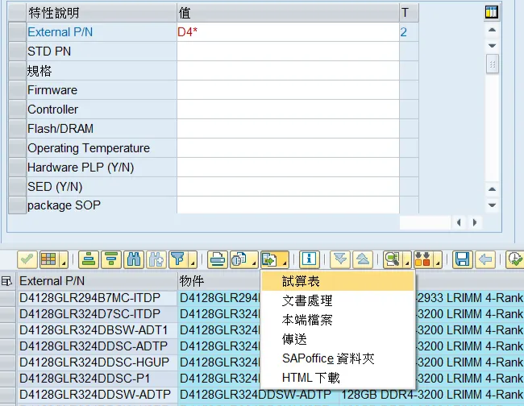

### 料號基本資料 MM03 {#mm03}

-   [**不可**]{style="color:red;"}模糊查詢
-   選擇欲檢視的項目
    -   **基本資料 1** 可察看物料狀態
    -   **分類** 顯示結果同 [**CL30N**](#cl30n)

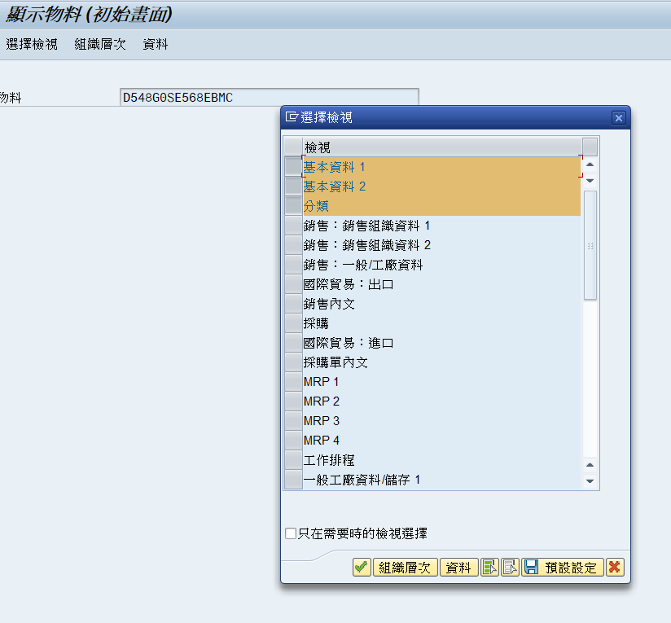

### 料號基本資料清單 ZQMM060 {#zqmm060}

-   Plant: **1011** (ATP KH)
-   Sales Organization: **1010** (ATP HQ)
-   物料可模糊(\*)查詢
-   [**BPM-物料申請**](#bpm-pn) [\@ref(bpm-pn)] 填寫重量時，可在此查詢類似料號的重量 (同 DIMM Type, PCB)

------------------------------------------------------------------------

## BOM查詢: CS03/ CS11; CS14; CS15/ CS15M; ZRPP012 {#sap-bom-query}

### BOM查詢 {#sap-bom}

#### 單階: CS03 {#cs03}


-   用途:

    -   字母+數字: ES BOM　i.e. **A1**

    -   數字+字母: MP BOM　i.e. **1A**

#### 多階: CS11 {#cs11}

請參閱 [***`P:\BU2_DRAM\Public\Rebecca\SAP-查詢BOM.pptx`***]{style="color:red;"}

比 [**CS03**](#cs03) 好看 

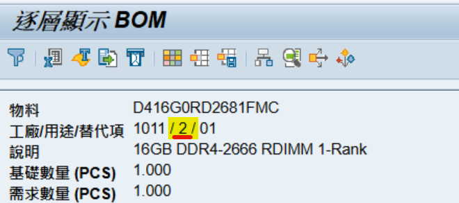

-   用途:

    -   **1**: MP BOM

    -   **2**: ES BOM

### BOM比較: CS14 {#cs14}

輸入要比較的兩個料號然後按 enter 即可

### 用料查詢 {#sap-material-query}

#### 單階: CS15 {#cs15}

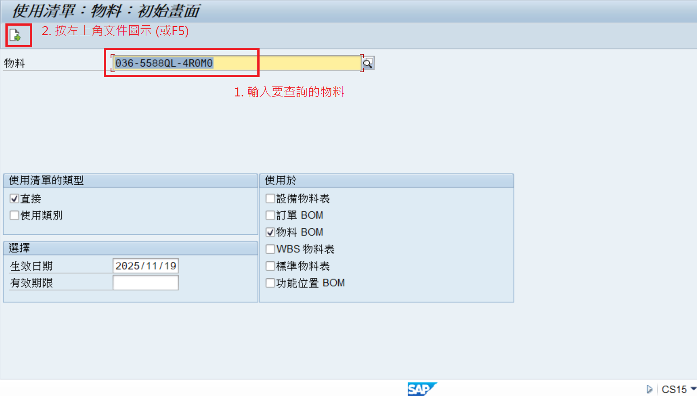

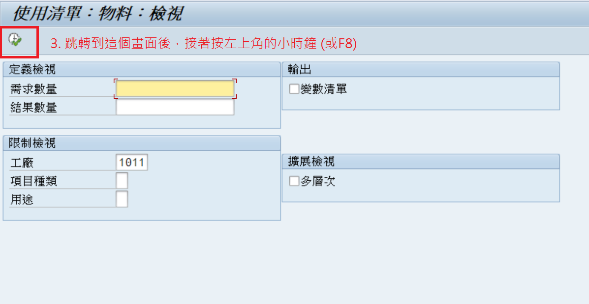

#### 多階: CS15M {#cs15m}

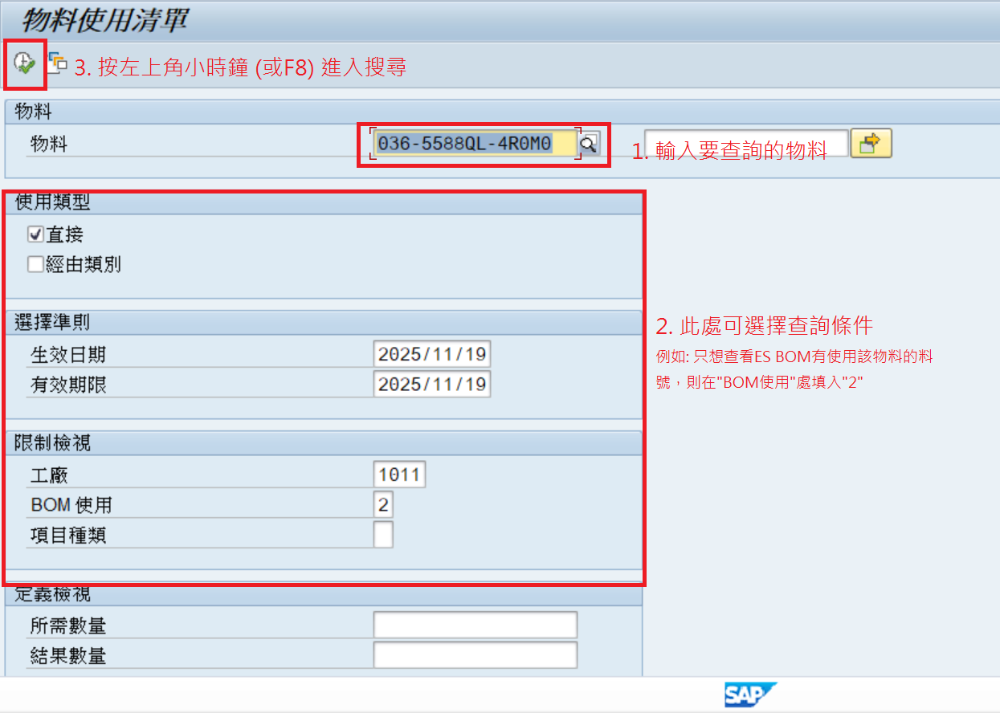

### 替代查詢: ZRPP012 {#zrpp012}

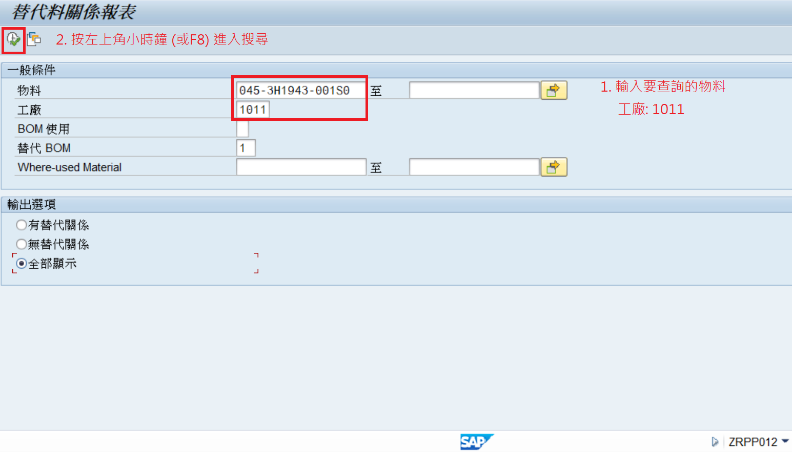

------------------------------------------------------------------------

## 庫存查詢: MB52 {#mb52}

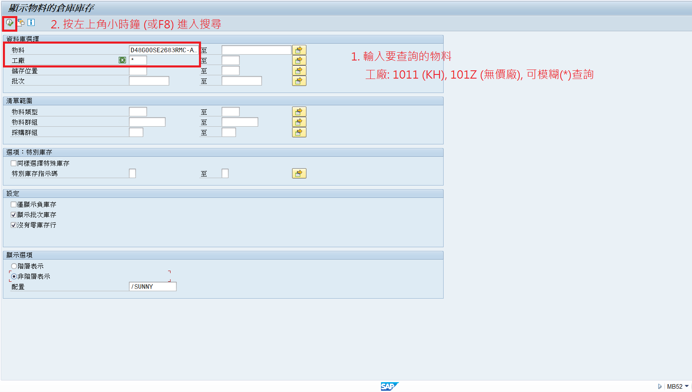

顯示以下結果: 

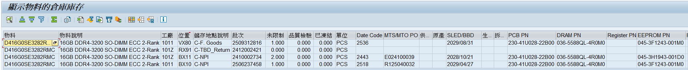

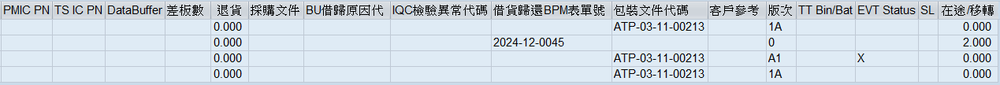

-   可看到該庫存 BOM 組成(不是每個都有)
-   點選上排彩色方格可以更改配置，查看更多資訊

------------------------------------------------------------------------

## Routing查詢: CA03 {#ca03}

-   可查看是否有 Outsourcing

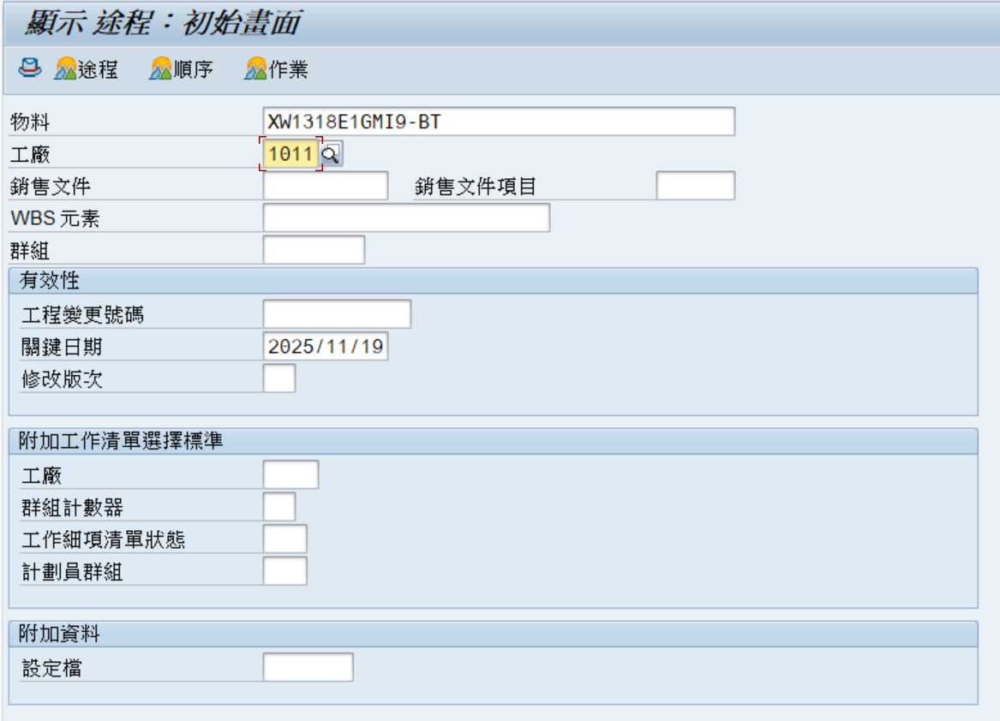

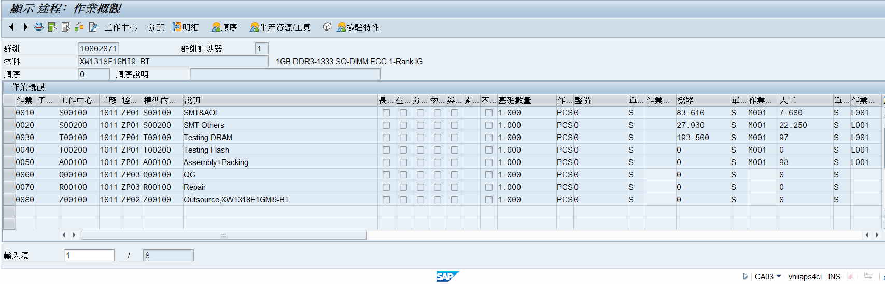

------------------------------------------------------------------------

## 工單用料明細查詢: ZRPP014 {#zrpp014}

-   可查看料號相關工單
-   可搭配 [**WMS系統 [查詢工單、出通單]**](#wms) [\@ref(wms)]使用以獲取更詳細資訊

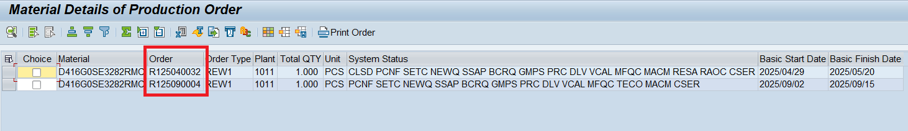

---
