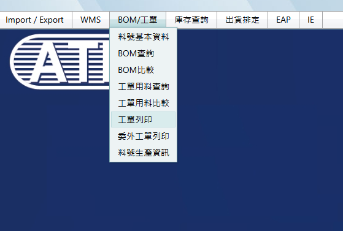
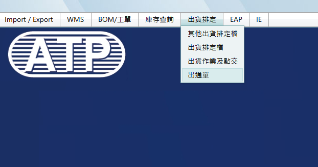
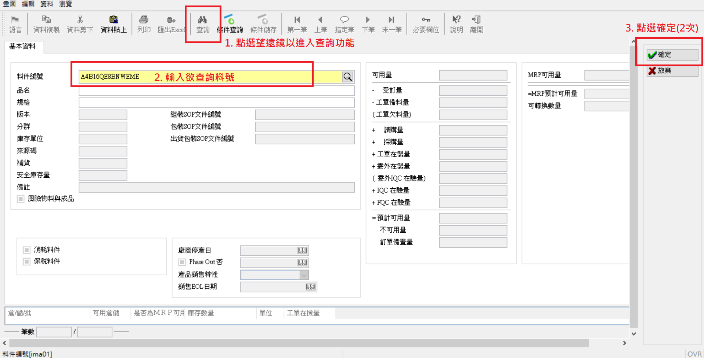
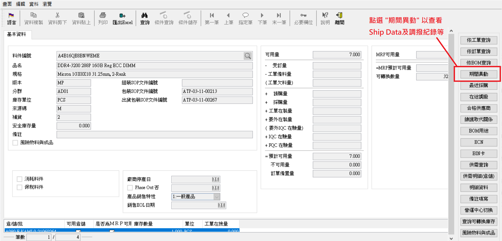
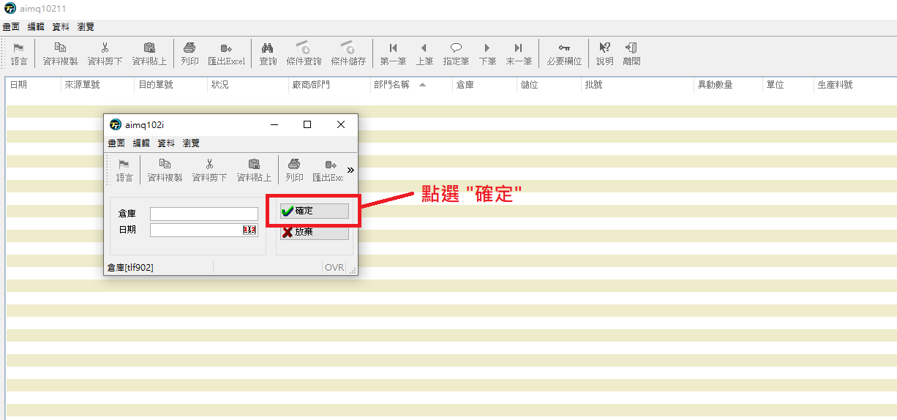
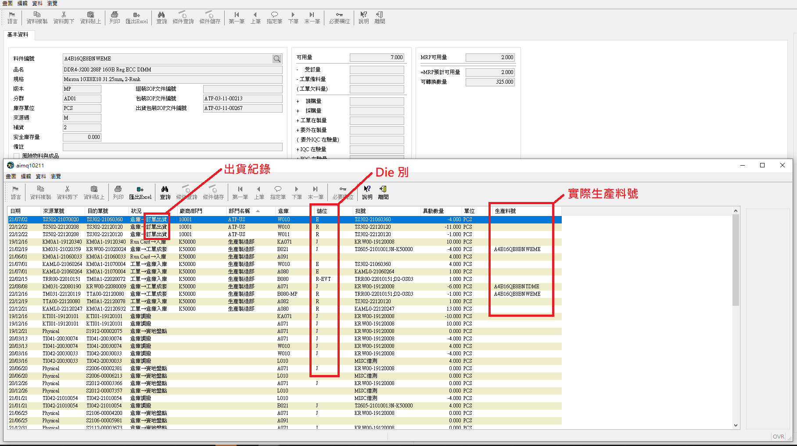

# ATP其他網站&軟體使用

## [WebISO](http://webiso.atpinc-tw.com/){target="_blank"} [SOP用] {#webiso}

💡 可用素材資源: [***`P:\BU2_Dram\Protected\packaging SOP`***]{style="color:red;"} 之 ppt 等

💡 記得套用最新版文件格式

💡 SOP 更新後請同步儲存至[***`P:\BU2_Dram\Protected\packaging SOP`***]{style="color:red;"} & [***`M:`***]{style="\"color:red;"} 對應資料夾以便紀錄。

### 全新SOP {#new-sop}

詢問 DCC Lolita 取得文件編號 → [**製作SOP**](#making-sop) → 務必與Calvin, Johnny, Sam, Sunny, Williams等[**確認SOP無誤**](#confirm-sop) → [**WebISO入DCC**](#dcc)

#### 取得文件編號

-   提供 **DCC Lolita盧麗芬** 相關 SOP 資訊（package/ shipping SOP; 文件標題），請 Lolita 提供文件編號

### 既有SOP改版 {#existed-sop}

WebISO 下載現行最新版 SOP → [**修改SOP**](#modify-sop) → 務必與 Calvin, Johnny, Sam, Sunny, Williams 等[**確認SOP無誤**](#confirm-sop) → [**WebISO入DCC**](#dcc)

#### 下載現行最新版SOP

-   文件盤點 → 於標準書編號輸入欲查詢之SOP編號 → 以ISO Reader檢視doc檔並儲存原始文檔

#### 製作/修改SOP {#making-sop}

-   注意版次。若要新增貼紙等資訊須請**高雄 Williams 等人**提供貼紙並給予相關資訊與意見。

#### 確認SOP無誤 {#confirm-sop}

-   提供PDF檔，寄信請Calvin Chang, Johnny Cheng, Sam Liu, Sunny Lo, Williams Lin 及相關需求提出人員確認內容無誤後再入 DCC。

#### WebISO入DCC {#dcc}

##### **\<全新SOP\>**

ISO文件中心 → ISO管理文件 → ☆三階作業指導書 → PM(13) → ⊞上傳文件 → 填寫相關欄位

-   標準書名稱: SOP for XXX xxx　[i.e., SOP for Alpha (明泰) All items Shipping]

-   標準書編號: 輸入 DCC Lolita 提供之編號

-   預計發行日: 視情況填寫

-   版本: **1.0** (因為是新的SOP)

-   制修訂摘要說明: First Release

-   需寄給供應商: 選「否」

-   是否教育訓練: 選「否」

-   選擇加簽相關人員: 固定要有 Calvin Chang, Johnny Cheng, Williams Lin, Sunny Lo, Sam Liu; 視情況加入原需求提出人員

-   選擇相關簽核單位: 固定品管部、生產製造組、製造工程組

-   原申請人姓名: 填自己

-   附件: 成批上傳 → 檔案分類: 選擇主文並按送出 → 上傳doc & pdf檔

##### **\<既有SOP改版\>**

文件盤點 → 輸入欲改版之標準書編號 → ⟳文件改版 → 填寫相關欄位

-   細項同全新 SOP，惟版本為舊版 **＋0.1**

#### 參考 {#sop-reference}

```{r, echo=FALSE}
xfun::embed_file("P:/BU2_Dram/Public/Rebecca/excel/參考用/重量材積對照表20240110_6.xlsx", text="重量材積對照表")
```

------------------------------------------------------------------------

## [WMS系統](http://192.168.21.165/Default.aspx){target="_blank"} [查詢工單、出通單] {#wms}

### 查詢工單

-   可先至 [**SAP-ZRPP014**](#zrpp014) [\@ref(zrpp014)] 查詢料號對應工單 



### 查詢出通單



---

## TipTop (轉移到 SAP 以前建立的料號) {#tt}

### 查詢 Ship Data

- 作業代號: **aimq102** (料件數量明細查詢-動態資料)










---
