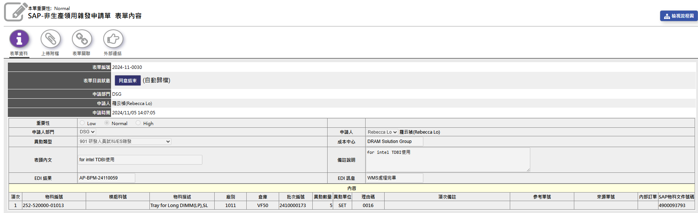

# Intel TDBI流程 {#inteltdbiprocess}

💡 請先參閱 [***`P:\BU2_Dram\Public\Intel原廠條測試`***]{style="color: red;"}

💡 雜發領 tray(前置作業) (\@ref(tdbi-tray)) → 確認實體料號 (\@ref(tdbi-mpn)) → excel 記錄 (\@ref(tdbi-excel)) → 雜收入庫 (\@ref(tdbi-issue)) → 寄往高雄 (\@ref(tdbi-deliver)) → email TDBI 庫存資訊 (\@ref(tdbi-email))

## 雜發領 tray {#tdbi-tray}

[非生產領用雜發申請單填寫說明](#bpm-receipt) [\@ref(bpm-receipt)]

## 確認實體料號 {#tdbi-mpn}

-   撕除原廠 label 以外之貼紙 (其實撕擋到金手指的貼紙就可)
-   ATP 目前只測**三星**、**美光**、**海力士**原廠條，若收到其它廠牌請詢問 WBS Mandy 應如何寄回該條
-   裝到 tray 時同料號放一起，不同料號間隔一個空位，每種料號第一條上貼[**標籤註明**]{style="color:red;}在雜收單上之序號

## excel紀錄 {#tdbi-excel}

💡 excel 連結: [***`P:\BU2_DRAM\Public\Intel原廠條測試\Intel 原廠條測試 PN List.xlsx`***]{style="color:red;"}

-   新增工作頁: **第XX批**

    |     | 500 PN | DPN | Vender | Intel PN | MPN | Qty |     | Total |
    |-----|--------|-----|--------|----------|-----|-----|-----|-------|
    | 1   |        |     |        |          |     |     |     |       |
    | 2   |        |     |        |          |     |     |     |       |

-   若料號在 excel 中無記錄，則須申請 500\* PN & DPN

    -   500\* PN第**五**碼須為英文(∵ Intel TDBI為Customer Supply)

## 雜收入庫 {#tdbi-issue}

-   累積多一點再寄 (至少快滿一大tray的數量)

-   BPM → 非生產領用雜收申請單 → 輸入 500\* PN → 選擇 101Z 無價倉…

  - 填寫細項請參考章節開頭之 [**Intel原廠條測試**](#inteltdbiprocess)

-   將該單 500 PN & Qty 資訊印出貼在 Tray 上

    |     | 500 PN | Qty |
    |-----|--------|-----|
    | 1   |        |     |
    | 2   |        |     |

-   可參考 [Intel TDBI 雜收單](http://bpm.atpinc.com.tw/FM7_FormContent.aspx?EinB64=UmVxdWlzaXRpb25JRD1hYTdkMjZhNS04YTM5LTQ1YzgtOTA2YS1jZGFjNDBjODgwYjkmSWRlbnRpZnk9U00wMDE2JkRpYWdyYW1OYW1lPVNBUC0lRTklOUQlOUUlRTclOTQlOUYlRTclOTQlQTIlRTklQTAlOTglRTclOTQlQTglRTklOUIlOUMlRTYlOTQlQjYlRTclOTQlQjMlRTglQUIlOEIlRTUlOTYlQUU=){target="_blank"}

## 寄往高雄 {#tdbi-deliver}

-   用橡皮筋套在 tray 中間，外面用泡泡紙包裹 (櫃檯旁邊的長桶子裡有泡泡紙)
-   每周二、四 14:00 前拿到櫃檯寄給 高雄 **Yuchi Lin** (分機: 7736)

## email TDBI 庫存資訊 {#tdbi-email}

-   料號累積一定數量後(約 100↑)，上 SAP-MB52 刷庫存(倉庫: 101\*)匯出後，與 excel 資料做 mapping，再整理成表格寄給 WBS Mandy 請他通知 Hollie 下單

    | DPN | Intel PN | MPN | Qty   |
    |-----|----------|-----|-------|
    | ... | ...      | ... | ...   |
    |     |          |     | total |

## Intel TDBI New DPN Setup 

- 請參考 [**Intel TDBI 料號建立**](#intel-tdbi-dpn-setup)

-   可參考歷史申請紀錄 (**D\*ITDP**)

    -   須注意陸續都有發過異動單，請以 SAP 資訊為準

---
