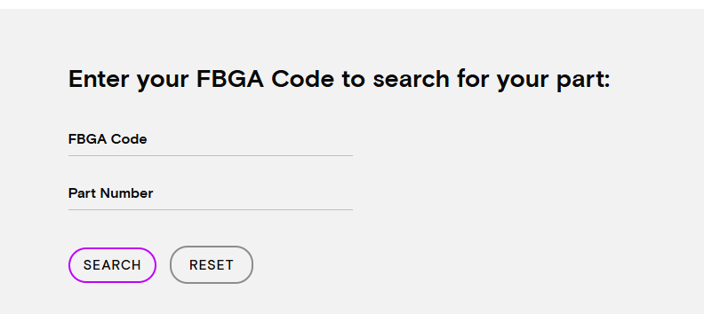

# 其他資訊查詢 {#other-info}

## DVT Report {#dvt}

請參考以下路徑

1.  [***`P:\BU2_Dram\Private\DVT Report`***]{style=color:red;"}

2. [***`P:\R&D Engineering\Testing\Protected\# Formal (DVT) Test Report #\DRAM`***]{style=color:red;"}

3. [***`K:\Engineering1\Public\DVT Test`***]{style="color:red;"}

---

## Micron FBGA & PN Decoder {#micron-fbga}

💡 [Micron FBGA and component marking decoder](https://www.micron.com/sales-support/design-tools/fbga-parts-decoder){target="_blank"}

- 透過 **FBGA** 或 **美光PN** 查找另一項資訊

---

## DRAM 功耗計算器 {#power-calculator}

💡 [Micron--DRAM 功耗計算器](https://tw.micron.com/sales-support/design-tools/dram-power-calculator){target="_blank"}

---
